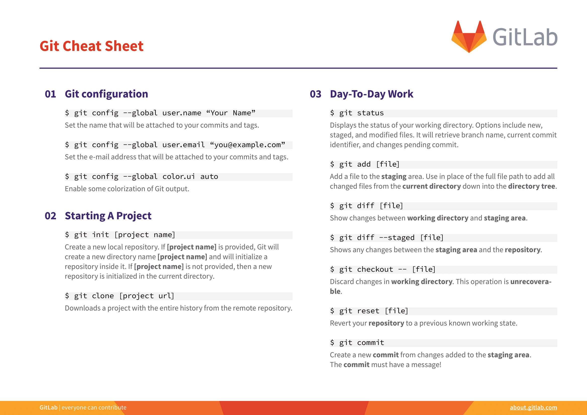
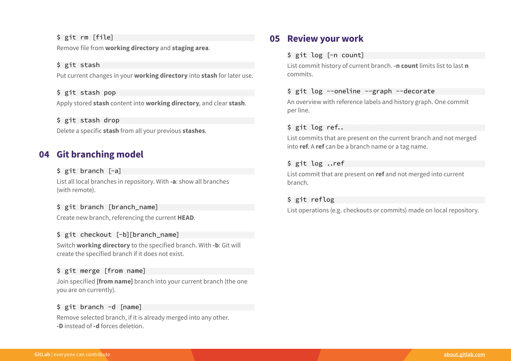
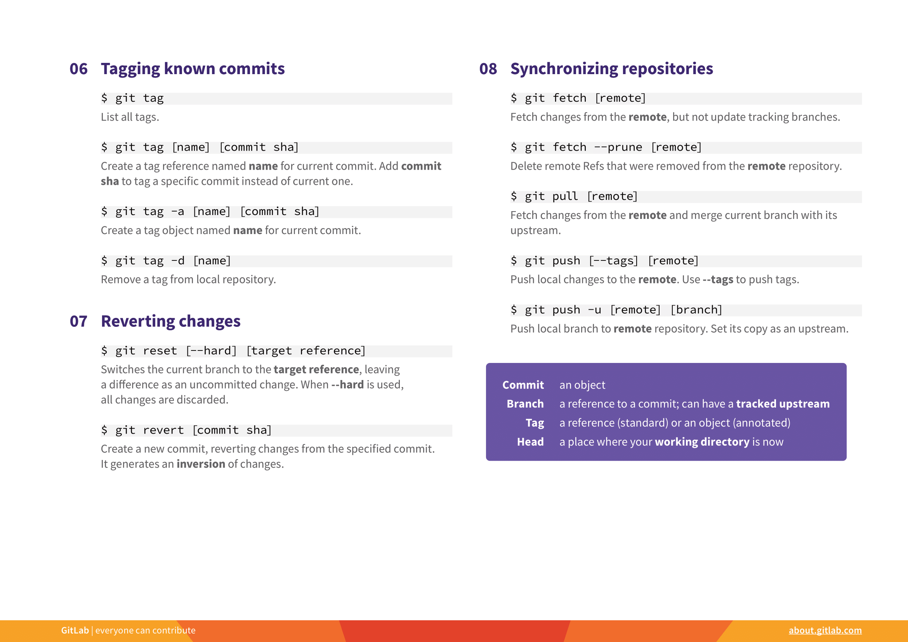

#Git

## reference

Practical DEVOPS and Clound Engineer โดย อ.ดร.ณัฐโชติ พรหมฤทธิ์

## Note

- ทำไมต้อง control version

## 1. Git คือ ?

Git เป็นเครื่องมือที่ช่วยจัดการเวอร์ชันของโค้ดให้กับเรา (Version Control)ในปัจจุบัน โดยจะเก็บประวัติว่าไฟล์แต่ละไฟล์ถูกสร้าง/ลบ/แก้ไขโดยใคร เมื่อไหร่ และอย่างไรเอาไว้ทั้งหมด ทำให้เราสามารถติดตามการเปลี่ยนแปลงของโค้ดได้ตลอด หรือแม้กระทั่งย้อน Version ของโค้ดกลับไปก่อนตอนที่จะทำการแก้ไขก็ได้

## 2. ความเป็นมาของ Version Control ก่อนที่จะมาเป็น Git

### 2.1 การจัดเก็บเวอร์ชั่นด้วยวิธีการก๊อปปี้ (Copy File & Folder)


**ข้อดี**

- ง่าย

**ข้อเสีย**

- งง
- ไม่รู้ว่าไฟล์ไหนใหม่กว่ากัน
- ไม่สามารถบอกได้ว่าไฟล์ไหนถูกสร้างต่อยอดมาจากไฟล์ไหน
- เปลืองพื้นที่จัดเก็บ เนื่องจากต้อง Copy ไฟล์ทั้งไฟล์ หรือทั้ง Folder

### 2.2 การจัดเก็บเวอร์ชั่นด้วยวิธีแพตช์ (Patch)


จากภาพด้านบนแสดงตัวอย่างของ Patch ที่เกิดจากการเปรียบเทียบไฟล์เก่า (Original file) และ ไฟล์ใหม่ (Changed File) Patch ที่สร้างจะแสดงถึงบรรทัดที่มีการเปลี่ยนแปลง โดยใช้เครื่องหมาย < นำหน้าบรรทัดที่หายไป และ > นำหน้าบรรทัดที่เพิ่มมาแทน

**ข้อดี**

- ลดพื้นที่การจัดเก็บ

**ข้อเสีย**

- มีความเสี่ยงต่อการทำ Patch บาง Patch หาย จนทำให้ไม่สามารถประกอบร่าง Source Code เพื่อกลับไปยัง Version ต่างๆ ได้

### 2.3 Local Version Control System

เพื่อแก้ปัญหาจากการที่จัดเก็บแบบ Patch จึงมีการพัฒนา Version Control System ที่มี Database เฉพาะคอยจัดเก็บทุกการเปลี่ยนแปลงของ Source Code โดยเราจะเรียกการจัดเก็บ Version ของ Source Code ลง Database ว่าการ "Check-In" และการเรียกคืน Source Code จาก Database เพื่อทำงานต่อว่าการ "Check-Out"


Local Version Control System เป็น Version Control ในยุคแรกๆ ที่มีความสามารถในการจัดเก็บ Version (Check-In) พร้อมทั้งข้อความช่วยจำ (Log Message) ลง Database และเรียกคืน Version จาก Database (Check-Out) กลับมายังพื้นที่ทำงาน (Working Directory) เพื่อให้ Software developers แก้ไข Source Code ต่อไป โดยเราสามารถมอง Local Version Control System ได้อีกแบบดังภาพด้านล่าง


แต่การ Check-Out จากผู้ใช้หลายคนพร้อมกันอาจทำให้เกิดปัญหาขึ้นดังภาพด้านล่าง


เมื่อวิธวินท์ และกันตพร Check-Out Source Code ออกจาก Database แต่วิธวินท์ทำงานเสร็จก่อนจึงได้ Check-In กลับเป็นคนแรก เมื่อกันตพร ทำงานของตนเองเสร็จจึง Check-In บ้าง ในกรณีนี้เนื้อหาที่เพิ่งถูกเพิ่มโดย วิธวินท์ใน Version ก่อนหน้าจะถูกลบทิ้ง

เพื่อแก้ปัญหาการสูญเสียข้อมูลเมื่อมีการ Check-Out จากผู้ใช้หลายคนจึงต้องมีการ Lock Database ไว้ ไม่ให้ผู้ใช้ที่ทำงานเสร็จช้ากว่า สามารถ Check-In ตามหลังได้ ซึ่งทำให้เป็นข้อจำกัดสำคัญของ Local Version Control System

### 2.4 Centralized Version Control System

Version Control ในยุคต่อมาจึงพยายามแก้ปัญหาการใช้งานหลายคน โดยเก็บ Database ไว้บน Server เมื่อผู้ใช้ Check-Out งาน version เดียวกัน แล้วกลับมา Check-In ระบบจะพยายามรวมเนื้อหาเข้าด้วยกัน (Merge) ถ้ารูปแบบการรวมเนื้อหามีความเรียบง่าย ระบบจะ Merge ให้อัตโนมัติ แต่ถ้าการรวมมีความซับซ้อน ระบบจะแจ้งให้ผู้ใช้ผู้ตัดสินใจแทน


โดยเราสามารถมอง Centralized Version Control System ได้ดังภาพด้านล่าง


Centralized Version Control System ที่ได้รับความนิยมคือ Subversion (SVN)

### 2.5 Distributed Version Control System

อย่างไรก็ตาม Centralized Version Control System มีข้อเสียสำคัญคือมันเป็นการทำงานแบบรวมศูนย์ หาก Server ล่มไปชั่วขณะ ผู้ใช้งานจะไม่สามารถ Check-In หรือ Check-Out งานได้ ถ้า Server เสียหายถาวร Version ของ Source Code ทั้งหมดก็ได้รับผลกระทบด้วย

เพราะการดึงงานจาก Centralized Version Control System จะเป็นการ Check-Out เฉพาะเวอร์ชั่น แบบ Online ขณะที่ Distributed Version Control System จะแก้ปัญหาการทำงานแบบรวมศูนย์โดยการ Clone Database มาทั้งหมด (โดยเราจะเรียก Database ที่จัดเก็บ Version ของ Source Code ว่า Repository)

ซึ่งเมื่อ Clone มาแล้วเราสามารถ Check-In และ Check-Out ใน Local Host แบบ Offline ก่อนจะ Push ขึ้นสู่ Server ในภายหลัง

โดยเราสามารถมอง Distributed Version Control System ได้ดังภาพด้านล่าง


Distributed Version Control System ที่สำคัญตัวหนึ่ง คือ BitKeeper ซึ่งเป็น Closed Source ไม่ใช่ Open Source โดย BitKeeper ได้ถูกนำมาใช้ในการเก็บ Source Code ของระบบปฏิบัติการ Linux ในปี 2002 แบบให้ใช้ฟรี อย่างไรก็ตามในปี 2005 BitKeeper ไม่ฟรีอีกต่อไป ถ้าเราเป็น Linus Torvalds ผู้ก่อตั้ง Linux เราจะแก้ปัญหานี้อย่างไร

สำหรับ Linus แล้ววิธีแก้ปัญหาของเขาคือการพัฒนา Distributed Version Control System ขึ้นมาเองในชื่อว่า Git และจากจุดนี้เอง Git จึงถือกำเนิดขึ้นมาในปี 2005 และเปิดให้ใช้งานแบบ Open Source และ Free Software ตั้งแต่นั้นเป็นต้นมา

## 3. หลักการพื้นฐานของ Git

Git เป็น Distributed Version Control System ตัวหนึ่งที่ได้รับความนิยมอย่างมาก เริ่มพัฒนาโดย Linus Torvalds ด้วยภาษา C, Shell Script, Perl, Tcl และ Python เริ่มใช้ครั้งแรกในปี 2005 และเปิดให้ใช้งานแบบ Open Source

### 3.1 Git vs other VCS

Git เป็น Distributed Version Control System ซึ่งต้องมีการ Copy Version ของ Source Code มาเก็บไว้ที่ Local host ก่อน ทำให้ผู้ใช้สามารถแก้ไข Project ได้ทุกที่แบบ Offline และ Check-In Source Code บน Local Repository โดยไม่ต้องติดต่อกับ Repository บน Server (Remote Repository) พอแก้ไขเสร็จแล้วก็ค่อยสั่ง Sync ข้อมูล (Pull/Merge/Push) ทีหลัง

ดังนั้นเมื่อเราสามารถทำทุกอย่างบน Local Host ได้ มันจึงเร็วกว่า SVN ที่เป็น Centralized Version Control System อย่างมาก

นอกจากนี้ Git ยังมีความแตกต่างกับ Version Control System อื่นๆ ในเรื่องของการจัดเก็บข้อมูล Version โดย Version Control System ทั่วไปจะเก็บเป็น Link ของความเปลี่ยนแปลง หรือส่วนต่างระหว่าง Version ดังภาพด้านล่าง


แทนที่จะเก็บส่วนต่างระหว่าง Version, Git เก็บ Version ของ Source Code เป็น Snapshot และอ้างถึง File ที่ไม่มีการเปลี่ยนแปลงใน Version ก่อนหน้า ทุกครั้งที่มีการ Check-In มันจะถ่ายรูปไฟล์ของเราว่ามีหน้าตาเป็นอย่างไร (Snapshot) โดย Git มองข้อมูลที่จัดเก็บเป็นเหมือน File System เล็กๆ หนึ่ง ดังภาพด้านล่าง


### 3.2 Git Work Flow

Git แบ่งสถานะของไฟล์ที่มันจะติดตาม (Tracked) เป็น 3 สถานะ คือ Modified, Staged และ Committed

สถานะ **Modified** หมายถึงเราได้แก้ไขไฟล์ไปแล้ว แต่ยังไม่เริ่มกระบวนการจัดเก็บลง Repository

สถานะ **Staged** หมายถึงเราได้ทำเครื่องหมาย File ที่ได้ถูกแก้ไข เพื่อจะบันทึกใน Version หน้า

สถานะ **Committed** หมายถึงข้อมูลถูกบันทึกอย่างปลอดภัยใน Repository บน Local Host

ซึ่งจะแสดงการเปลี่ยนสถานะของไฟล์ในส่วนต่างๆ ดังภาพด้านล่าง


จากภาพ Workflow ของ Git มีกระบวนการดังนี้

เมื่อมีการเรียกคืน Source Code ใน Version หนึ่งๆ จาก Git Repository (Check Out), Source Code เหล่านั้นจะถูกนำมาวางที่ Working Directory

- เราจะแก้ไขไฟล์ใน Working Directory (ไฟล์ที่แก้ไขจะอยู่ในสถานะ Modified)
- รวบรวมไฟล์ที่ถูกแก้ไขลงใน Staging area เพื่อจะ Commit ใน Version ถัดไป (ไฟล์ที่ถูกรวบรวมจะอยู่ในสถานะ Staged)
- Commit เพื่อนำไฟล์จาก Staging Area ไปจัดเก็บอย่างถาวรใน Local Repository (ไฟล์ที่ถูกบันทึกลง Repository อยู่ในสถานะ Commited)

## 4. เริ่มต้นใช้งาน Git (Gitlab)

https://gitlab.com/

### 4.1 Register & Sign in Gitlab

### 4.2 สร้าง Project บน Gitlab

### 4.3 การเชื่อมโยงกับ Remote Repository

### 4.4 การติดตั้ง Git Client และการเรียกใช้งาน

https://git-scm.com/downloads

- ทดสอบ git command

```sh
git version
```

### 4.5 การ Config Git ให้พร้อมใช้งาน

```sh
git config --global user.name "Aukkarapong.W"
git config --global user.email "zixboo@hotmail.com"

cd /mnt/c

git init --initial-branch=master

git status

git add file-a.html
# git add <file_name> // ระบุไฟล์ เช่น git add index.html about.html
# git add . // ทุกไฟล์ที่อยู่ภายใต้ Directory ปัจจุบัน
# git add --all หรือ git add -A // ทุกไฟล์ใน Project
# git add *.html // หลายไฟล์ระบุนามสกุล

git commit -m "add file-a.html"
# git commit -am "ข้อความอธิบายการเปลี่ยนแปลง" // -am = รวมทั้ง add และ commit ในคราวเดียวกันก็ใช้

git log
# git log // คำสั่งใช้ดูประวัติการ commit ต่างๆ ของRepo โดยจะแสดง เลขcommit, commit message, ชื่อผู้เขียน, email, และเวลาที่ commit นั้นๆ
# git log --oneline // แสดงแต่ละlog เหลือบรรทัดเดียว
# git log --pretty=oneline // แสดงแต่ละlog เหลือบรรทัดเดียว แต่แสดง commit เต็มไม่ซ่อน
# git log --graph // แสดงเป็นเส้น Branch ให้ดูง่ายขึ้น
# git log --oneline --graph // ถ้าใช้แบบนี้จะดูง่ายขึ้นมาก


# git config --list // แสดงเฉพาะ Repository นี้
# git config --global --list // แสดงทั้งหมด

git remote -v
git remote add origin https://gitlab.com/zixboo/lern-git.git
# git push <remote_name> <branch_name> // ตัวอย่าง git push origin master

# git config --global --add safe.directory '*'

git pull origin master

git push origin master

git clone <git url>

```

### 4.8 การ Sync History กับ Gitlab Server

## 5. Git Branching

## 6. สรุป Git Command

[Reference. :: https://about.gitlab.com/images/press/git-cheat-sheet.pdf](https://about.gitlab.com/images/press/git-cheat-sheet.pdf)





